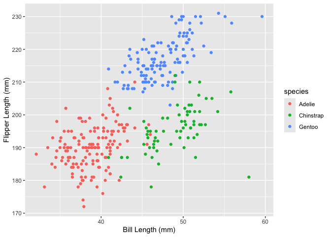

p8105_hw1_imo2121.Rmd
================
Ian O’Keeffe
2026-09-23

``` r
library(tidyverse)
```

    ## ── Attaching core tidyverse packages ──────────────────────── tidyverse 2.0.0 ──
    ## ✔ dplyr     1.2.1     ✔ readr     2.2.0
    ## ✔ forcats   1.0.1     ✔ stringr   1.6.0
    ## ✔ ggplot2   4.0.3     ✔ tibble    3.3.1
    ## ✔ lubridate 1.9.5     ✔ tidyr     1.3.2
    ## ✔ purrr     1.2.2     
    ## ── Conflicts ────────────────────────────────────────── tidyverse_conflicts() ──
    ## ✖ dplyr::filter() masks stats::filter()
    ## ✖ dplyr::lag()    masks stats::lag()
    ## ℹ Use the conflicted package (<http://conflicted.r-lib.org/>) to force all conflicts to become errors

``` r
data("penguins", package = "palmerpenguins")
```

Investigate the data properties

``` r
head(penguins)
```

    ## # A tibble: 6 × 8
    ##   species island    bill_length_mm bill_depth_mm flipper_length_mm body_mass_g
    ##   <fct>   <fct>              <dbl>         <dbl>             <int>       <int>
    ## 1 Adelie  Torgersen           39.1          18.7               181        3750
    ## 2 Adelie  Torgersen           39.5          17.4               186        3800
    ## 3 Adelie  Torgersen           40.3          18                 195        3250
    ## 4 Adelie  Torgersen           NA            NA                  NA          NA
    ## 5 Adelie  Torgersen           36.7          19.3               193        3450
    ## 6 Adelie  Torgersen           39.3          20.6               190        3650
    ## # ℹ 2 more variables: sex <fct>, year <int>

``` r
num_rows = nrow(penguins)
num_cols = ncol(penguins)
mean_bill_length <- round(mean(pull(penguins, bill_length_mm), na.rm = TRUE), 2)
```

The data is a collection of 8 variables across 344 observed penguins.
The variables include the species, island, bill length in mm, bill depth
in mm, flipper length in mm, body mass in grams, sex, and year observed.
The average bill length is 43.92 mm.

Here is a scatter plot of flipper length vs bill length.

``` r
ggplot((penguins), aes(x=bill_length_mm, y = flipper_length_mm, color=species)) + geom_point() + labs(x = "Bill Length (mm)", y = "Flipper Length (mm)")
```

    ## Warning: Removed 2 rows containing missing values or values outside the scale range
    ## (`geom_point()`).

<!-- -->

Create a dataframe consisting of a random sample of numbers, a logical
vector, a character vector, and a factor vector.

``` r
sample = rnorm(10)
log_vector = sample > 0
char_vector = c("a", "b", "c", "d", "e", "f", "g", "h", "i", "j")
factor_vector = factor(rep(c("Small", "Medium", "Large"), length.out = 10))

df = tibble(random_sample = sample, logical_vector = log_vector, character_vector = char_vector, factor_vector = factor_vector)
df
```

    ## # A tibble: 10 × 4
    ##    random_sample logical_vector character_vector factor_vector
    ##            <dbl> <lgl>          <chr>            <fct>        
    ##  1         0.480 TRUE           a                Small        
    ##  2        -0.556 FALSE          b                Medium       
    ##  3        -0.307 FALSE          c                Large        
    ##  4         0.293 TRUE           d                Small        
    ##  5        -1.31  FALSE          e                Medium       
    ##  6         0.718 TRUE           f                Large        
    ##  7        -0.522 FALSE          g                Small        
    ##  8        -1.17  FALSE          h                Medium       
    ##  9        -0.927 FALSE          i                Large        
    ## 10         0.207 TRUE           j                Small

``` r
mean(pull(df, random_sample))
```

    ## [1] -0.3095833

``` r
mean(pull(df, logical_vector))
```

    ## [1] 0.4

``` r
mean(pull(df, character_vector))
```

    ## Warning in mean.default(pull(df, character_vector)): argument is not numeric or
    ## logical: returning NA

    ## [1] NA

``` r
mean(pull(df, factor_vector))
```

    ## Warning in mean.default(pull(df, factor_vector)): argument is not numeric or
    ## logical: returning NA

    ## [1] NA

We are only able to get the means of the random sample and logical
vectors. Let’s try converting them to numbers:

``` r
as.numeric(pull(df, logical_vector))
as.numeric(pull(df, character_vector))
as.numeric(pull(df, factor_vector))
```

The logical factor is converted into 1s and 0s, as expected by a logical
binary. The character vector throws an error and is coerced into a
vector of NAs This makes sense, since there is no intuitive way to turn
an arbitrary string into a number. The factor vector is converted into
1s, 2s, and 3s, as their factor categories are assigned. However, since
these are categorical abstractions, it does not make sense to use them
to find a mean.
